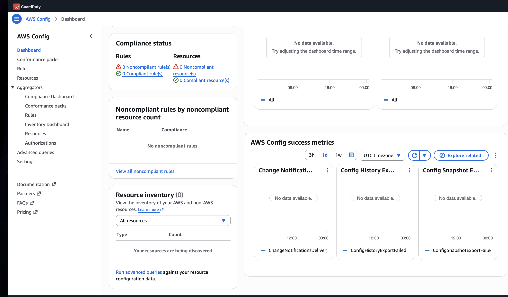
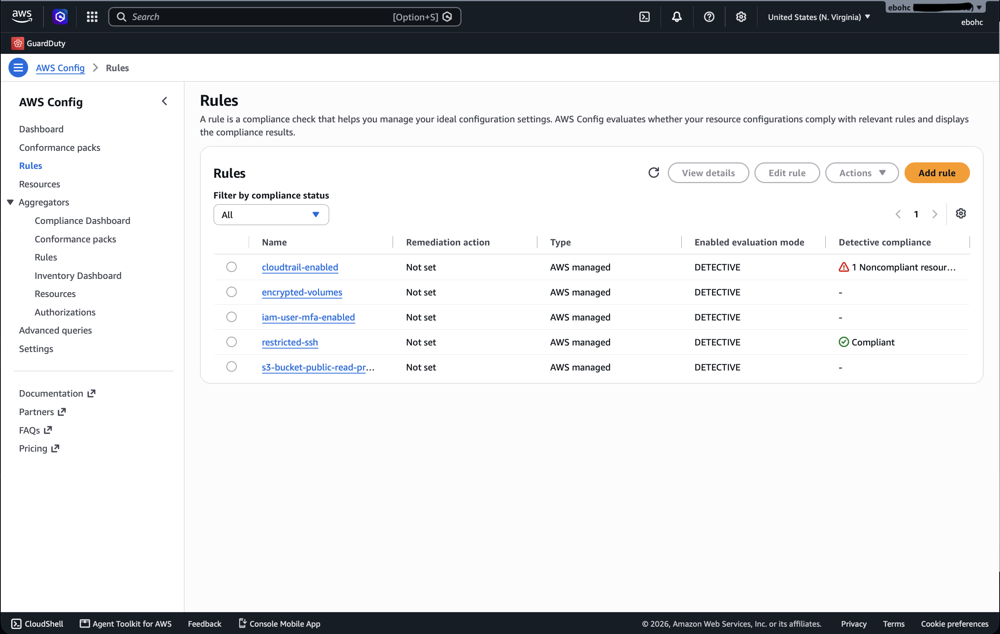
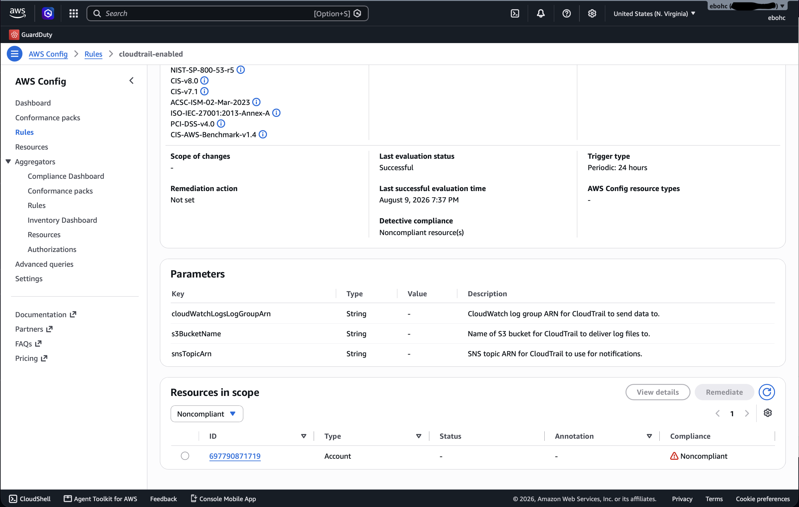
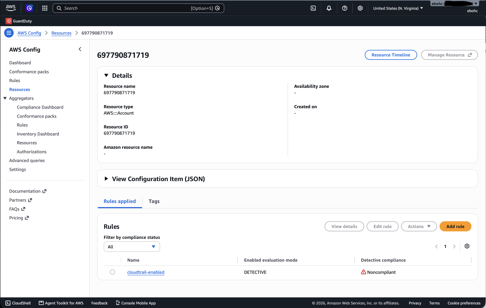
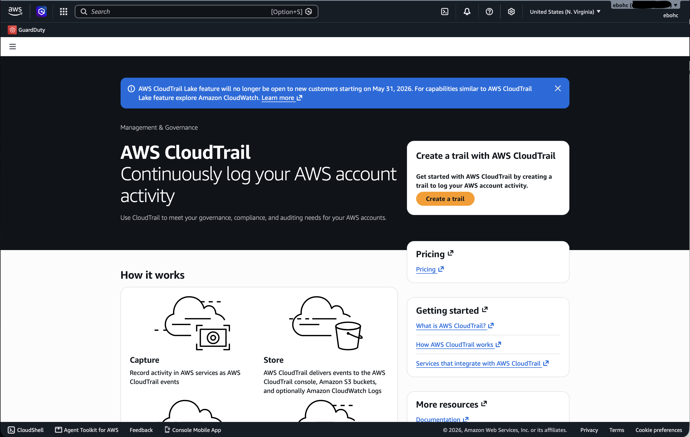
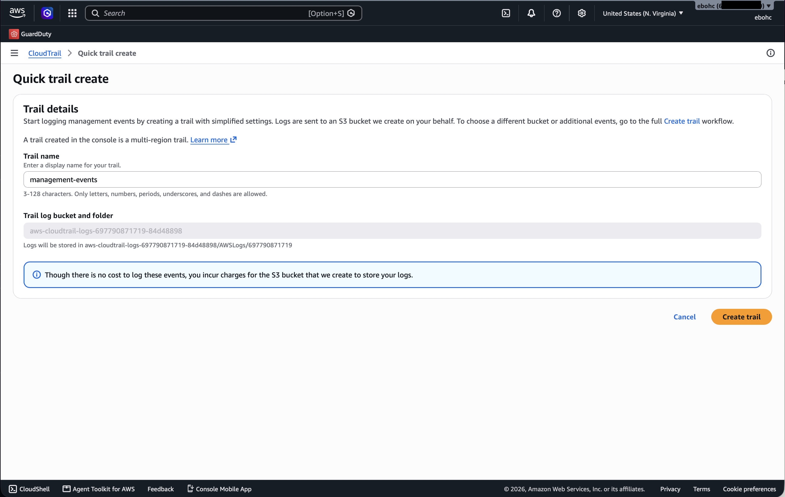
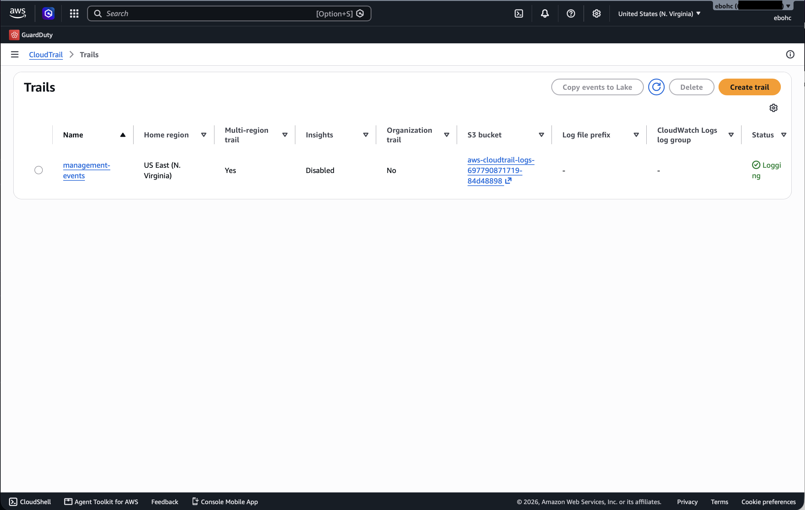
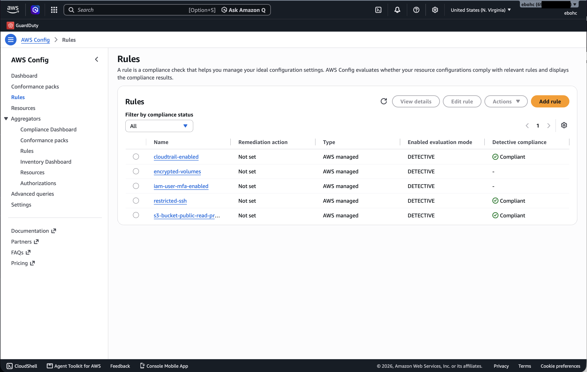

# Case Study: A Real Config Finding, Live

Everything in this document is a genuine account state, not staged. A
personal AWS account was used to deploy AWS Config with a small set of
security-relevant managed rules, and whatever Config actually found was
walked through, explained, and in one case, fixed, with the compliance
status change captured before and after.

GuardDuty is covered in this repo's [methodology](../README.md) and
[Terraform](../terraform) using AWS's own published finding type
catalog, since the account used for this case study is on a restricted
plan tier that doesn't yet have GuardDuty access without completing
additional account verification. Everything below is Config-specific,
and it's real.

## Setup

AWS Config was enabled through the console's 1-click setup, then five
security-relevant managed rules were added on top of the defaults:
`cloudtrail-enabled`, `encrypted-volumes`, `iam-user-mfa-enabled`,
`restricted-ssh`, and `s3-bucket-public-read-prohibited`, the same five
covered in this repo's control matrix.

**Screenshot 1**

The dashboard immediately after enabling, before the first evaluation
cycle completes. 0 compliant, 0 noncompliant, "your resources are being
discovered." This is the normal in-between state right after setup, not
an error, and it's worth including because most write-ups skip straight
to a populated dashboard and imply it happens instantly. It doesn't.

## The finding

Once evaluation completed, one rule came back with a real result.

**Screenshot 2**

`cloudtrail-enabled` shows **1 Noncompliant resource**. `restricted-ssh`
came back Compliant immediately. The other three showed no result yet,
meaning either evaluation hadn't finished or there were no applicable
resources in the account to check.

**Screenshot 3**

The finding detail page. This is the screenshot worth slowing down on,
because it does something genuinely useful: it lists every framework
this single rule maps to, directly in the console, with no extra work.
NIST SP 800-53r5, CIS v8.0, CIS v7.1, ACSC-ISM, ISO/IEC 27001:2013 Annex
A, PCI-DSS v4.0, and CIS AWS Benchmark v1.4, all from one rule
evaluation. That's AWS's own tooling confirming the same principle this
repo's [crosswalk](../../crosswalk) argues from a documentation
standpoint: one control, several frameworks satisfied at once. The
three Parameters (CloudWatch log group ARN, S3 bucket name, SNS topic
ARN) all show blank, which is the actual tell for what's wrong, there's
no CloudTrail configuration for the rule to check against.

**Screenshot 4**

Viewing the flagged resource directly confirms what's noncompliant is
the AWS account itself (`AWS::::Account`), not a specific service. This
is an account-level gap, not a partial misconfiguration on one
resource.

## Confirming the root cause

**Screenshot 5**

Navigating to CloudTrail directly, not through Config, confirms the
actual state. This is CloudTrail's own "get started" landing page, the
one it shows when no trail has ever been created. Not a misconfigured
trail. No trail at all. This is the more common real-world version of
this finding, a control that was simply never turned on, rather than a
subtler configuration error.

## Remediation

**Screenshot 6**

CloudTrail's Quick Trail Create form, named `management-events`,
multi-region by default. The console is explicit about cost here too:
no charge for logging management events themselves, only for the S3
bucket storing the resulting log files, which for a low-traffic account
runs to fractions of a cent.

**Screenshot 7**

Immediately after creation, the trail shows Status: Logging, multi-region:
Yes, with its S3 bucket created and linked. The control is now
actually in place, not just theoretically fixed.

## Verifying the fix

Config's `cloudtrail-enabled` rule listed its trigger type as periodic,
evaluating every 24 hours. Rather than waiting a full day, the rule was
manually re-evaluated after the trail went live.

**Screenshot 8**

`cloudtrail-enabled` now shows **Compliant**. `restricted-ssh` and
`s3-bucket-public-read-prohibited` also show Compliant. Only
`encrypted-volumes` and `iam-user-mfa-enabled` still show no result,
consistent with a small personal account having no EBS volumes or
non-root IAM users yet for those rules to evaluate against, an honest
gap, not an error.

## What this actually demonstrates

The value here isn't that CloudTrail got turned on, that's a two-minute
task. It's the full loop: a real control gap, found by a real tool,
explained in terms of what it actually means and which frameworks care
about it, fixed, and then verified as fixed through the same tool that
found it, not just asserted. That loop, find, explain, fix, verify, is
the actual job. Most GRC content stops at "here's what a clean dashboard
looks like." The more honest and more useful version is what this
document tried to show: a real gap, in a real account, closed and
proven closed.

---

*Part of the [AWS Continuous Compliance Monitoring](../README.md) reference, in the [GRC Toolkit](https://github.com/ebohc/grc-toolkit).*

Victor Eboh, GRC Lead | [LinkedIn](https://www.linkedin.com/in/evictorc/)
