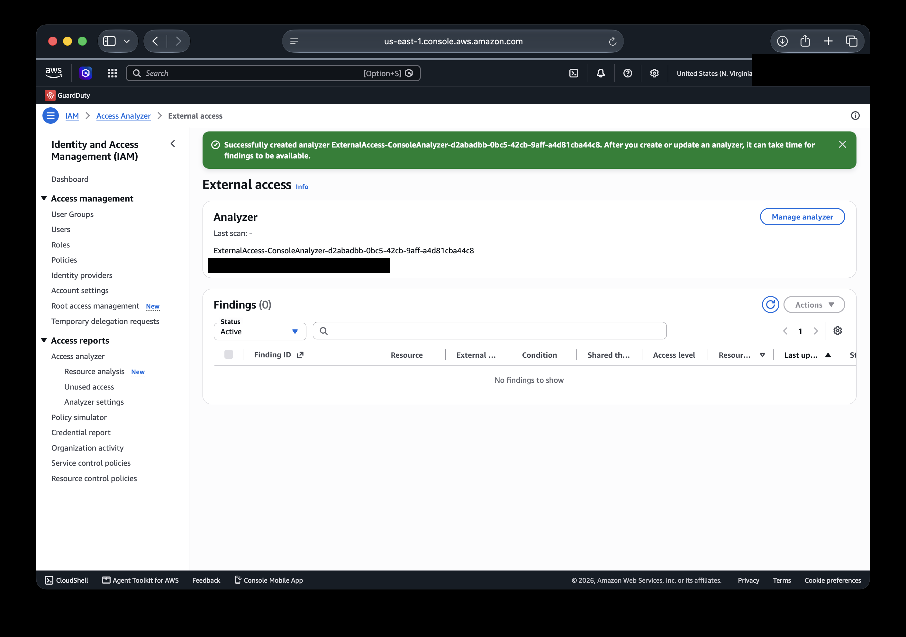
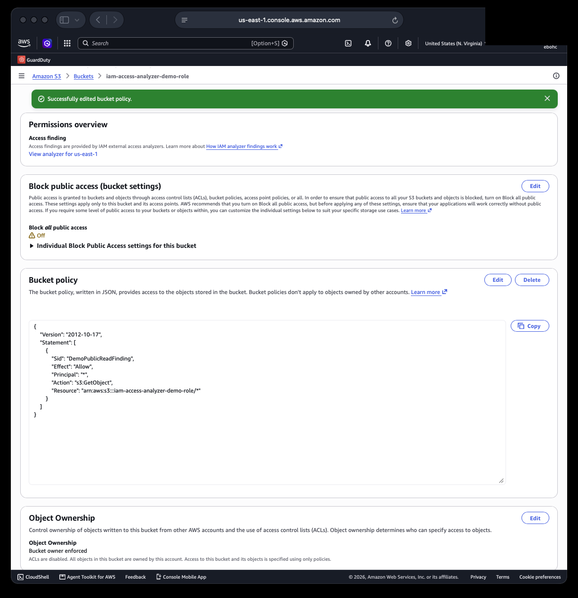
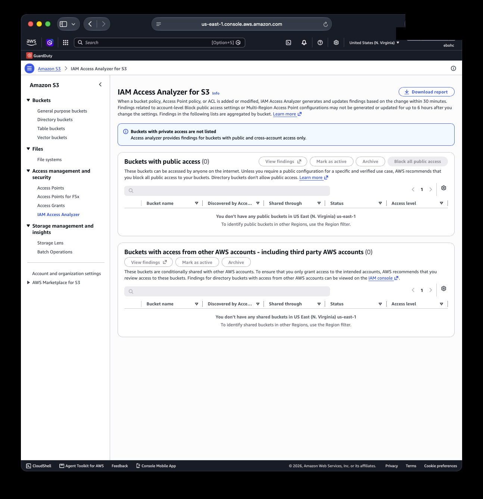
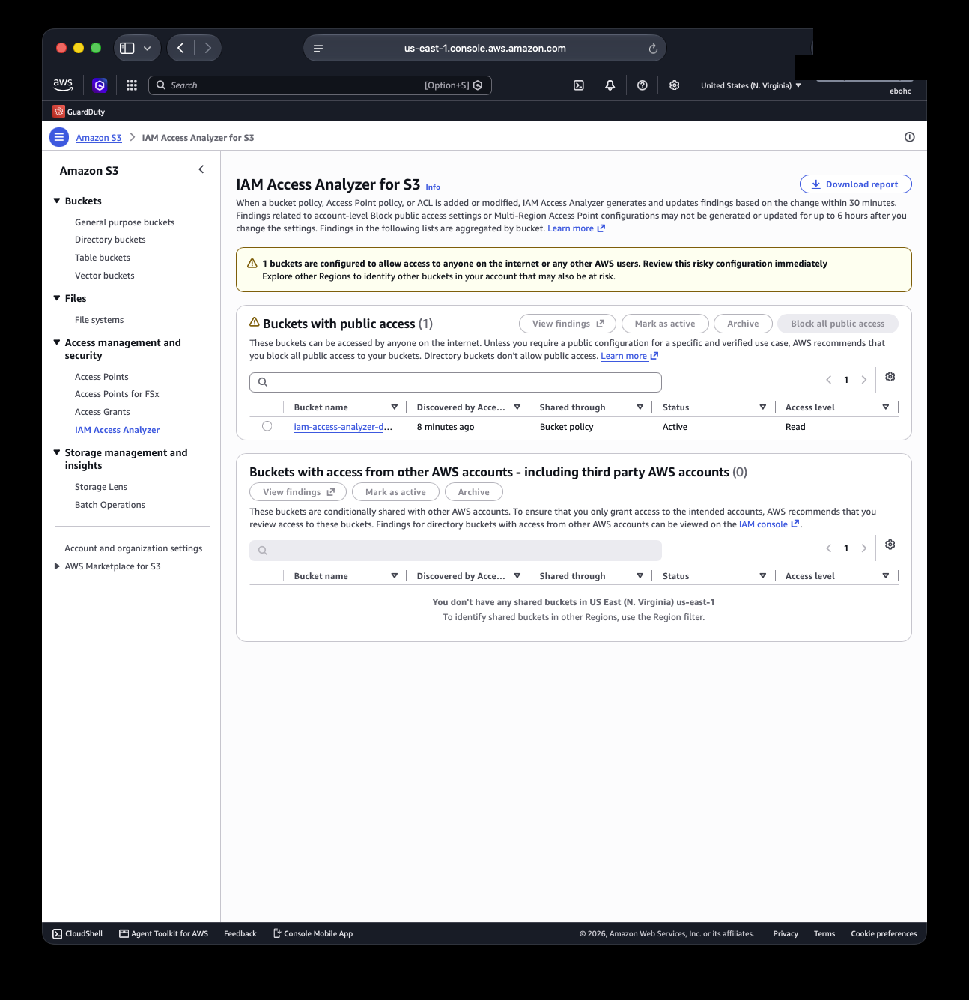
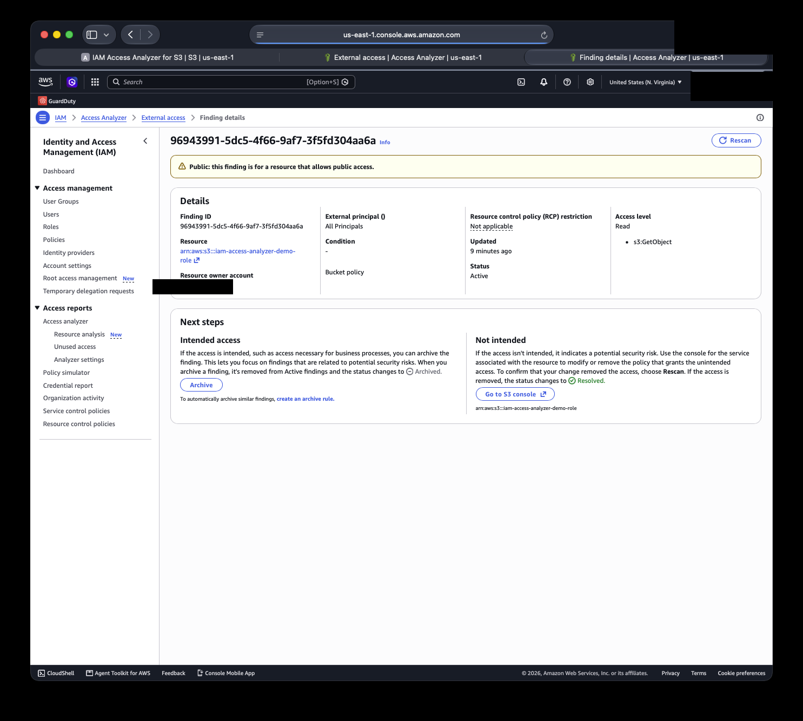
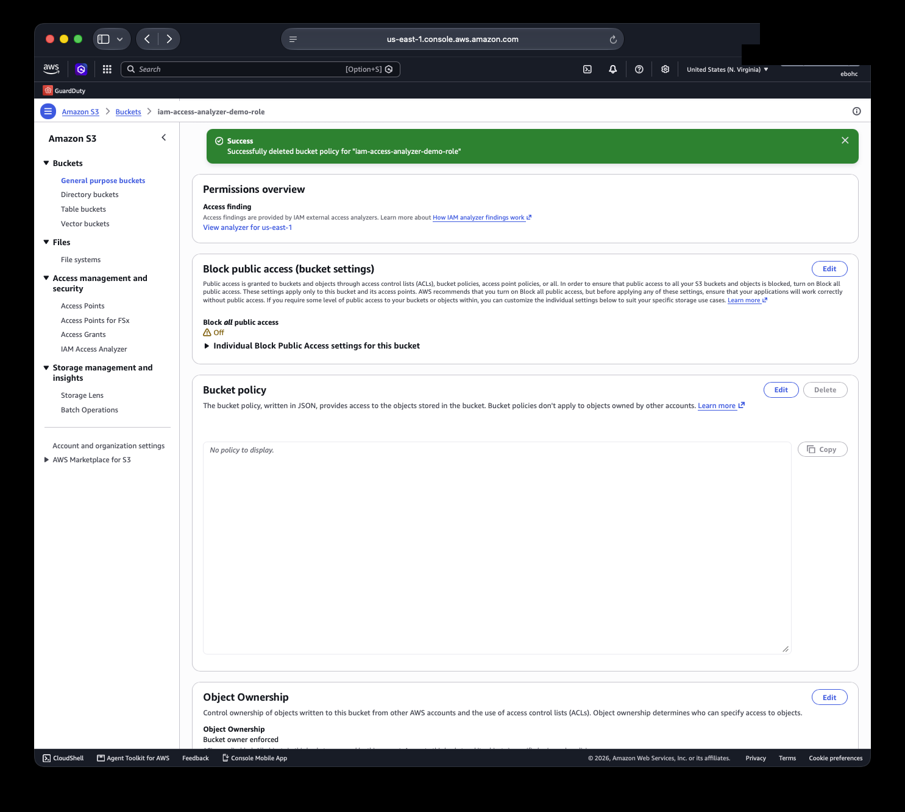
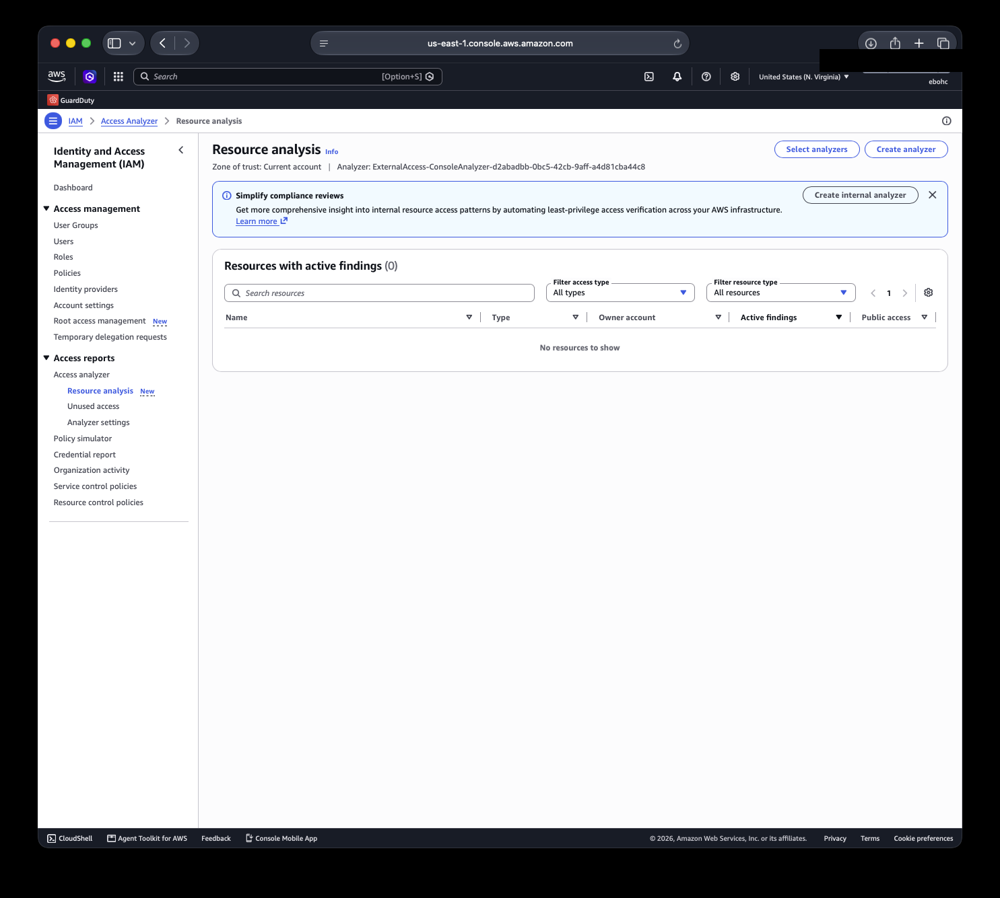
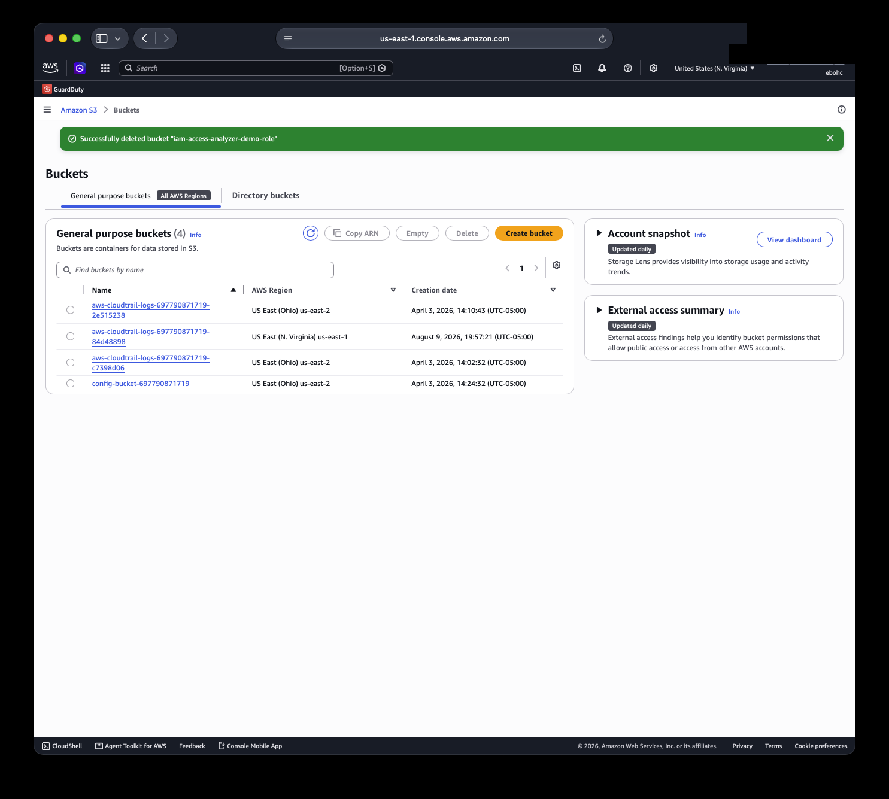

# Case Study: Finding and Fixing Real External Access, Live

Everything in this document is a genuine account state. A personal AWS
account was used to enable IAM Access Analyzer's External Access
analyzer, then a deliberate, safe test resource was created to generate
a real finding, walked through, fixed, and verified as resolved.

Unused Access and Internal Access analyzers, the two paid features
covered in this repo's [methodology](README.md), were not tested live,
since they carry a per-resource monthly cost and this case study was
built without incurring any charges. Everything below is External
Access specifically, and it's real.

## Setup

**Screenshot 1**

An External Access analyzer was created with the zone of trust set to
the current account. "Cost: no additional cost" was confirmed directly
on the creation screen before proceeding, this is the free path,
distinct from Unused and Internal Access. Immediately after creation,
findings are at zero and "Last scan" shows a dash, the analyzer hasn't
run its first pass yet.

## Generating a real, safe finding

A blank, empty S3 bucket was created specifically for this test, with
no data ever uploaded to it. Its Block Public Access setting was turned
off for this one bucket, and a policy was attached granting `s3:GetObject`
to `"Principal": "*"`, a genuinely public read grant, on an empty
bucket, purely to generate a real finding safely.

Two earlier attempts before this one are worth mentioning, since they
turned into a useful lesson rather than a dead end. The first attempt
tried granting access to an arbitrary AWS account ID as the external
principal, both as an S3 bucket policy and as an IAM role trust policy.
Both were rejected by AWS with "Invalid principal in policy," since AWS
validates that any account ID referenced as a principal actually
corresponds to a real, existing account, a genuine and useful control
in its own right. A public wildcard principal doesn't require that
validation, which is why the approach below works and is also, not
coincidentally, the single most common real-world External Access
finding type.

**Screenshot 2**

The policy saved successfully once Block Public Access was disabled for
this specific bucket. AWS's own console banner at the top confirms
"Successfully edited bucket policy."

**Screenshot 3**

Checking immediately after saving the policy still showed zero public
buckets. The console explains why directly: findings generate within
30 minutes of a policy change, not instantly. This is the same kind of
propagation delay covered in this repo's [AWS Config case study](../aws-continuous-compliance/case-study.md),
worth documenting honestly rather than implying every tool reacts in
real time.

## The finding

**Screenshot 4**

After waiting, the finding appeared: "1 buckets are configured to allow
access to anyone on the internet or any other AWS users. Review this
risky configuration immediately." Discovered 8 minutes after the policy
change, source "Bucket policy," status Active, access level Read.

**Screenshot 5**

The finding detail page gives a specific, complete picture: external
principal "All Principals," matching the wildcard in the policy exactly.
Access level Read, specifically `s3:GetObject`, nothing broader leaked
in beyond what the policy actually granted. Resource control policy
restriction shows "Not applicable," which just means this account isn't
part of an AWS Organization with RCPs configured, not a failure of
anything.

The most useful part of this screen is the "Next steps" panel, which
lays out the exact decision this repo's methodology argues for: if the
access is intended, archive the finding. If it isn't, fix the
underlying policy and click Rescan to confirm resolution. A finding
isn't automatically an incident, it's a prompt to make that call
explicitly rather than by default.

## Fixing it

Since this access was never intended, genuinely just a test, the
policy was deleted outright.

**Screenshot 6**

"Successfully deleted bucket policy" confirmed, and the policy box now
reads "No policy to display." The public grant no longer exists.

## Verifying the fix

**Screenshot 7**

Checking Resource analysis afterward shows "Resources with active
findings (0)," "No resources to show." The fix was picked up
automatically, without needing to manually trigger a rescan, the same
verified before-and-after arc as the Config case study: one real
finding, genuinely closed, confirmed by the tool itself rather than
just assumed.

## Cleanup

**Screenshot 8**

The test bucket was deleted entirely once the exercise was done,
"Successfully deleted bucket," leaving no unused resource behind and no
trace of the deliberate test in the account going forward.

## What this actually demonstrates

Two things worth pulling out. First, the same find, explain, fix,
verify loop as the Config case study, applied to a completely different
AWS service, showing this isn't a one-off trick that happened to work
once, it's a repeatable way of operating. Second, and less obvious: the
two failed attempts at the start, the rejected fictional account
principal, weren't wasted effort or a mistake to hide. AWS's own
validation caught something worth knowing about and folding into the
methodology, which is a more honest picture of how this work actually
goes than a version that only shows the parts that worked on the first
try.

---

*Part of the [IAM Access Analyzer](README.md) reference, in the [GRC Toolkit](https://github.com/ebohc/grc-toolkit).*

Victor Eboh, GRC Lead | [LinkedIn](https://www.linkedin.com/in/evictorc/)
