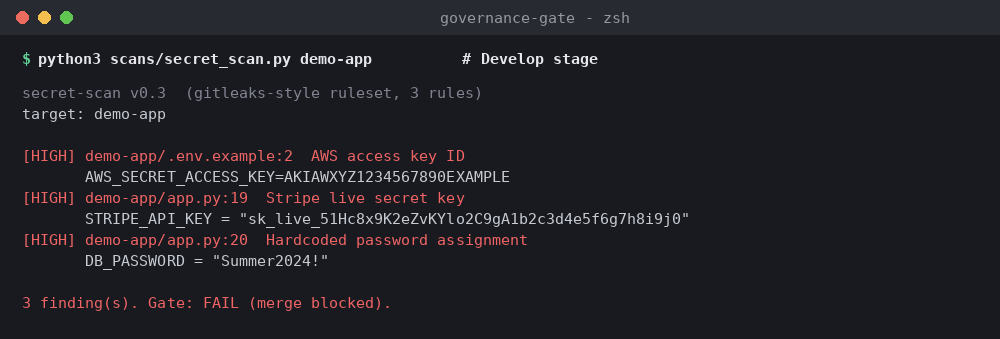
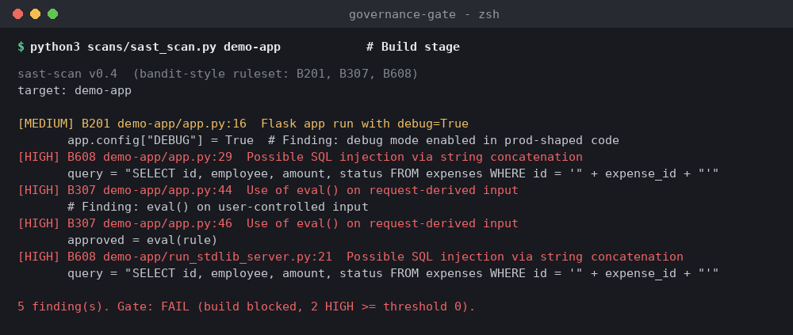
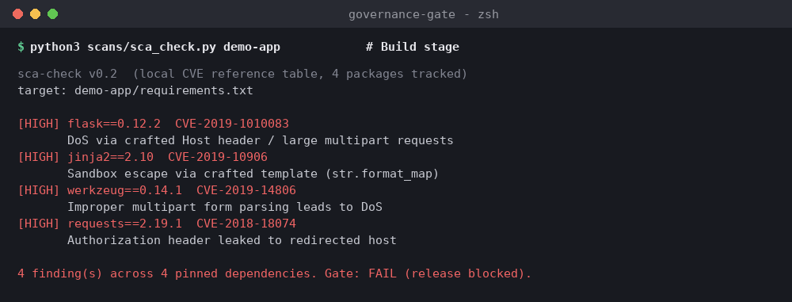
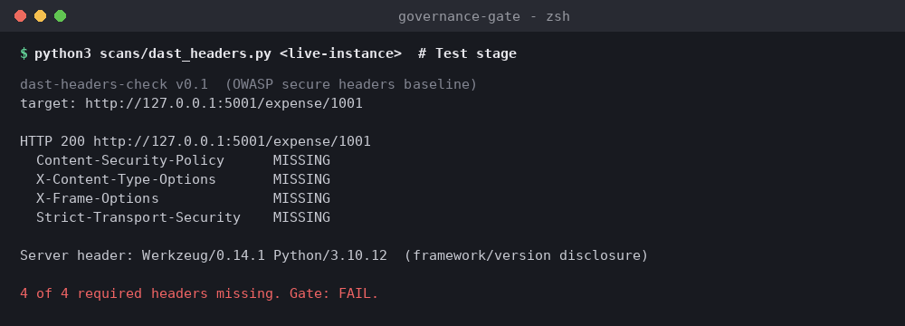
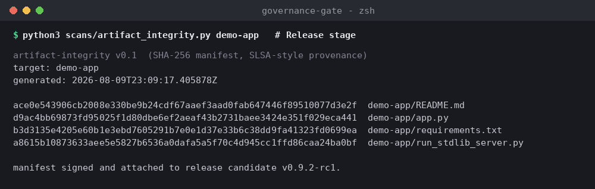
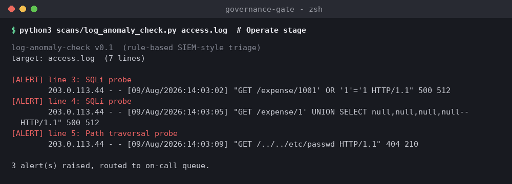

# Technology Risk Governance Across the SDLC: A Worked Example

Most SDLC security write-ups describe controls in the abstract. A design
review happens somewhere near the start, a scan happens somewhere near
the end, and everything in between is assumed to be fine. I wanted to
test that assumption directly, so I built a small, intentionally flawed
internal service and ran a real governance gate against it at every
stage of the SDLC, not just the two everyone already checks.

Every finding below is actual tool output, not a mockup. The scripts,
the screenshots, and the demo app itself are all in this repo.

## The service

`demo-app/` is `expense-approval-service`, a small internal API with two
routes: look up an expense claim, and approve one. It was built to be
scanned, not deployed. It's intentionally flawed in ways that map
directly to the risks a real SDLC governance program should be
watching for.

## Plan & Design: the threat model comes first

Before any code existed, I wrote a [STRIDE threat model](docs/threat-model.md)
for the service, what it needed to protect, and what mitigations the
design called for at each threat category. This matters for a reason
beyond process: the threat model is what makes everything that comes
after a *verification* exercise rather than a discovery exercise. I
already knew, on paper, that dynamic code evaluation on user input and
string-built SQL queries were things the design explicitly ruled out.
The gates below exist to catch it if that design intent doesn't survive
contact with actual code.

## Develop: the secret scan

```
$ python3 scans/secret_scan.py demo-app
```



Three findings, all HIGH: a live-format Stripe API key and a hardcoded
database password committed directly in `app.py`, and an AWS access key
sitting in `.env.example`, a file that gets committed precisely because
it's meant to be a template, which is exactly how real secrets end up
in git history more often than people expect.

This maps to NIST SSDF PW.4 and PW.7 (produce well-secured software,
review for security issues before release) and OWASP SAMM's
Implementation practice. It's a Develop-stage gate specifically because
catching this at commit time costs a rejected pull request. Catching it
after merge costs a credential rotation and, if it ships, potentially a
disclosure.

## Build: static analysis and dependency scanning

```
$ python3 scans/sast_scan.py demo-app
```



Five findings across two files. The SQL injection risk is the one worth
sitting with: `app.py` builds its query with plain string concatenation,
`"...WHERE id = '" + expense_id + "'"`, which means anything passed as
an expense ID becomes part of the query itself. The same pattern got
duplicated into `run_stdlib_server.py`, the dependency-free stand-in
built for this offline environment, which is its own small lesson:
a vulnerability copied into a second file for convenience is a
vulnerability that now needs fixing twice.

The `eval()` finding is the more serious one architecturally. The
approval endpoint evaluates a rule string from the request directly as
Python code. That's not a narrow SQL injection risk, that's arbitrary
code execution through a business logic endpoint that looks, on the
surface, like a harmless configuration convenience.

```
$ python3 scans/sca_check.py demo-app
```



Four pinned dependencies, four known CVEs. This is the finding type
people most often assume "someone else" is watching, the platform team,
a Dependabot alert nobody triaged, a security team with a different
backlog. Software composition analysis at the Build stage, run on every
build rather than periodically, closes exactly that gap. This maps to
NIST SSDF PW.4 and PS.3, and it's the same reasoning behind the
vulnerability remediation timing covered in this repo's
[vulnerability scan coverage reference](../vulnerability-scan-coverage):
a known CVE sitting in a pinned dependency is a finding a scanner will
always catch, the only question is whether anyone's actually running
the scan on a cadence that matters.

## Test: a baseline DAST check

```
$ python3 scans/dast_headers.py http://127.0.0.1:5001/expense/1001
```



Four out of four required security headers missing, and the server
header discloses framework and Python version to anyone who asks. None
of this shows up in a static scan, since it only exists once the
service is actually running. That's precisely why a Test-stage gate
exists separately from Build-stage SAST, some risk only becomes visible
once there's a live instance to probe against.

## Release: artifact integrity

```
$ python3 scans/artifact_integrity.py demo-app
```



A SHA-256 manifest of every source file, the same primitive behind SLSA
provenance attestations. The question this answers isn't "is the code
secure," the earlier gates already covered that. It's "is this exactly
the code that was reviewed and approved," a different and equally
important question. Without this, a release process has no way to
prove the artifact being deployed is the one that actually passed the
gates above it.

## Operate: log-based anomaly detection

```
$ python3 scans/log_anomaly_check.py logs/access-sample.log
```



Three alerts from seven lines of sample traffic: two SQL injection
probes and a path traversal attempt, all from the same source IP within
a ten-second window. This is a simple rule-based pass, standing in for
the SIEM correlation rules that would flag this in a real production
environment, but the underlying point holds regardless of tooling: the
SDLC doesn't end at deployment. A service that shipped clean can still
be actively probed the day after release, and Operate-stage monitoring
is the only gate on this list that's still running after every other
one has already signed off.

## What this adds up to

Six gates, six real findings, mapped in full in the
[Control Matrix](SDLC-Risk-Governance-Control-Matrix.xlsx) against NIST
SSDF, OWASP SAMM, ISO/IEC 27034, and NIST CSF 2.0, with a 1-5 maturity
rating at each stage. The pattern worth noticing isn't any single
finding. It's that every stage caught something the adjacent stages
wouldn't have: the secret scan doesn't catch SQL injection, SAST doesn't
catch missing headers, and none of the earlier gates catch live probing
after the code has already shipped. A program that only checks design
review and a pre-release scan is, structurally, only checking two of
six places where real risk actually shows up.

---

Template, demo app, and full control matrix:
[github.com/ebohc/grc-toolkit](https://github.com/ebohc/grc-toolkit)

Victor Eboh, GRC Lead | [LinkedIn](https://www.linkedin.com/in/evictorc/)
